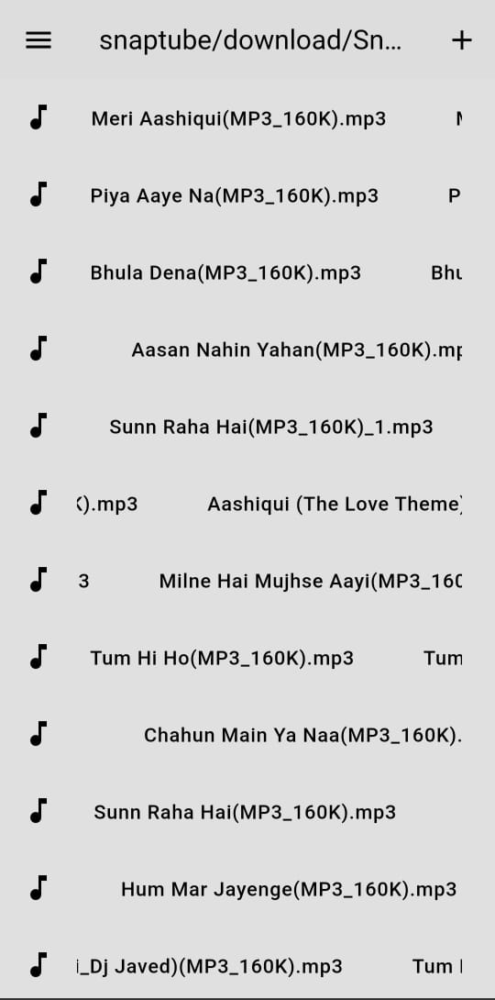
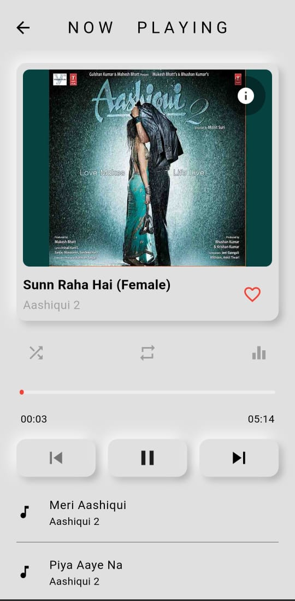
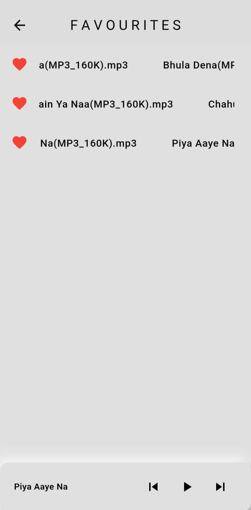
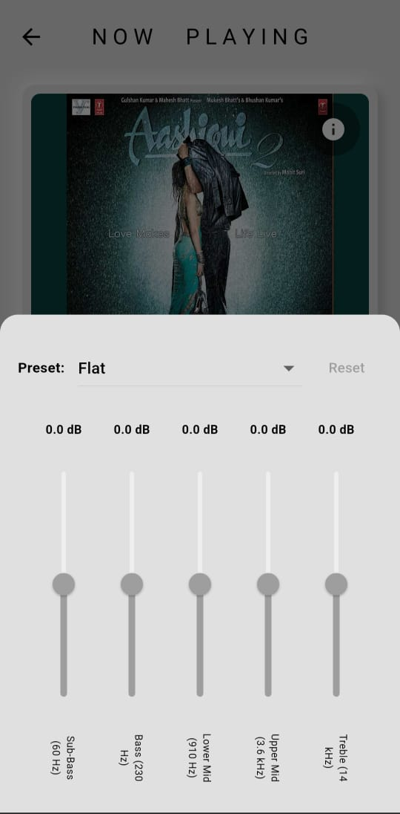
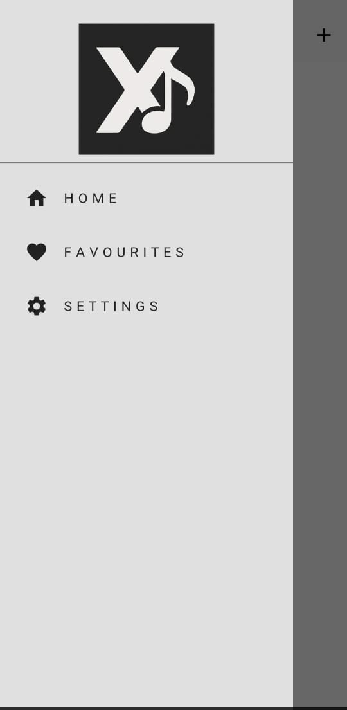

# 🎧 XBeat3 – Flutter Music Player App

**XBeat3** is a modern, feature-rich, and beautifully designed **music player app** built using **Flutter**. With a polished UI, automatic music scanning, and a custom-built equalizer, XBeat3 delivers a high-performance, personalized music experience right from your local storage.

---

## ✨ Features

- 🎵 **Local Music Playback** – Plays MP3 and audio files stored on your device.
- 🔍 **Auto Music Scanner** – Automatically fetches and indexes MP3 files from storage.
- 🎚️ **Custom Equalizer** – Fine-tune your sound with a fully interactive equalizer.
- 🧭 **Intuitive Navigation** – Easy switch between Home, Library, and Now Playing screens.
- 🌌 **Dark Mode Support** – Fully responsive and themed UI.
- 🎨 **Material 3 UI** – Clean and consistent design powered by Material You.
- 🔊 **Full Audio Control** – Supports play, pause, seek, volume, and shuffle.
- 📱 **Responsive Layouts** – Works seamlessly on phones and tablets.

---

## 🖼️ Screenshots

<p align="center">
  
  
  
  

</p>

---

## 🚀 Getting Started

### Prerequisites

- Flutter SDK (3.13 or newer recommended)
- Android Studio or VS Code
- Android Emulator or physical device

### Installation

```bash
git clone https://github.com/shivamdevelopment123/XBeat3.git
cd xbeat3
flutter pub get
flutter run
```

## 🛠️ Tech Stack
- Flutter – Cross-platform UI toolkit
- just_audio – Advanced audio playback
- custom build equalizer solution
- google_fonts, flutter_svg – UI enhancements
- (Include state management library: Provider)

---

## 📃 License
This project is licensed under the MIT License – see the LICENSE file for details.

---

## 💡 Contributions & Feedback
Feel free to open issues, report bugs, or submit pull requests. Your feedback helps improve XBeat3!